# HealthSync — Doctor Location Discovery Flow

## 1. Current Database Design

The current HealthSync design has four important entities:

```text
Doctor
  |
  +---- ManyToMany ---- Clinic
  |
  +---- ManyToMany ---- Hospital
  |
  +---- OneToMany ----- DoctorsAvailability
                              |
                              +---- ManyToOne ---- Clinic
                              |
                              +---- ManyToOne ---- Hospital
```

The physical location belongs to the **Clinic/Hospital**:

```text
Clinic
  ├── address
  ├── latitude
  └── longitude

Hospital
  ├── address
  ├── latitude
  └── longitude
```

The doctor's location-specific availability belongs to `DoctorsAvailability`:

```text
DoctorsAvailability
  ├── doctor
  ├── clinic OR hospital
  ├── weekday
  ├── startTime
  ├── endTime
  └── slotDuration
```

Therefore, the doctor does **not** need latitude/longitude in the `Doctor` table.

---

# 2. Entity Relationship Diagram

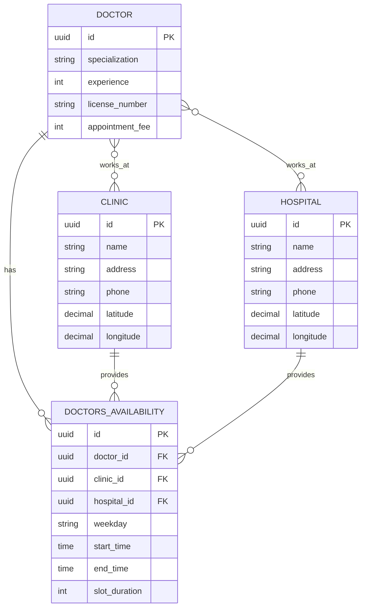

---

# 3. Meaning of Each Relationship

## Doctor → Clinic

```text
Doctor MANY ↔ MANY Clinic
```

A doctor can work at multiple clinics, and a clinic can have multiple doctors.

Example:

```text
Dr. Rahul
 ├── City Clinic
 └── Heart Care Clinic

City Clinic
 ├── Dr. Rahul
 ├── Dr. Amit
 └── Dr. Priya
```

This is correctly represented using `ManyToMany`.

---

## Doctor → Hospital

```text
Doctor MANY ↔ MANY Hospital
```

A doctor can work at multiple hospitals, and a hospital can have multiple doctors.

Example:

```text
Dr. Rahul
 ├── Apollo Hospital
 └── Medanta Hospital

Apollo Hospital
 ├── Dr. Rahul
 ├── Dr. Amit
 └── Dr. Priya
```

---

## Doctor → DoctorsAvailability

```text
Doctor 1 → MANY DoctorsAvailability
```

One doctor can have many schedules.

Example:

```text
Dr. Rahul

Availability #1
Monday
Apollo Hospital
09:00 - 13:00

Availability #2
Tuesday
City Clinic
16:00 - 20:00

Availability #3
Wednesday
Apollo Hospital
09:00 - 13:00
```

---

# 4. Why DoctorsAvailability Contains Clinic/Hospital

`DoctorsAvailability` is the important entity for the location-based scheduling requirement.

It answers:

> "Where is this doctor available, and when?"

For example:

```text
DoctorsAvailability
----------------------------
doctor       = Dr. Rahul
hospital     = Apollo
clinic       = null
weekday      = Monday
startTime    = 09:00
endTime      = 13:00
slotDuration = 15
```

Another record:

```text
DoctorsAvailability
----------------------------
doctor       = Dr. Rahul
hospital     = null
clinic       = City Clinic
weekday      = Tuesday
startTime    = 16:00
endTime      = 20:00
slotDuration = 15
```

This allows the same doctor to have different schedules at different facilities.

---

# 5. Physical Location

The physical location is stored only once.

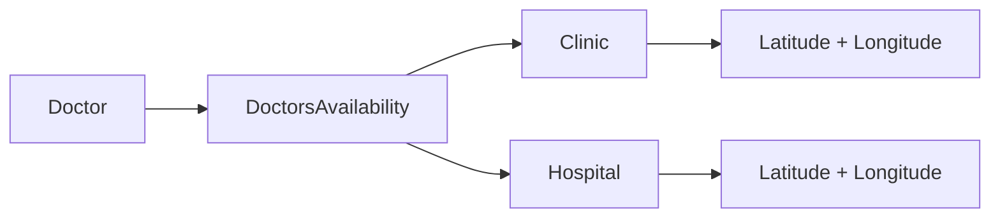

For example:

```text
Clinic:
City Clinic
latitude  = 23.3600
longitude = 85.3150
```

Every doctor associated with that clinic automatically uses those coordinates.

You should **not** duplicate:

```text
doctor.latitude
doctor.longitude
```

because a doctor can have multiple locations.

---

# 6. Doctor Adds a Location

The doctor does not directly enter a latitude/longitude for themselves.

Instead:

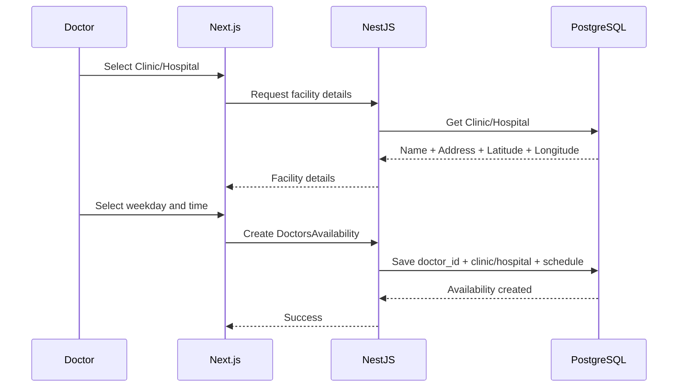

The doctor therefore creates a **schedule at a facility**, not a new physical location.

---

# 7. Doctor Location Selection with Google Maps

If the doctor is creating a new clinic/hospital, Google Maps can be used to select the facility's physical location.

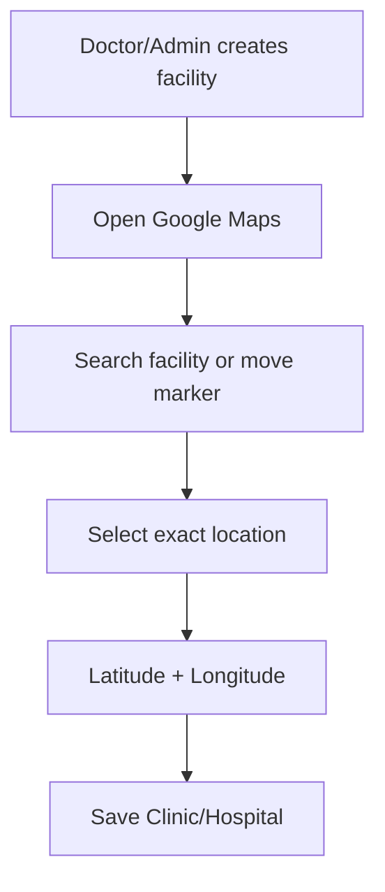

After the facility has been created:

```text
Clinic
 ├── name
 ├── address
 ├── latitude
 └── longitude
```

Doctors simply select that existing facility.

---

# 8. Patient "Find Nearby Doctors" Flow

The complete patient flow is:

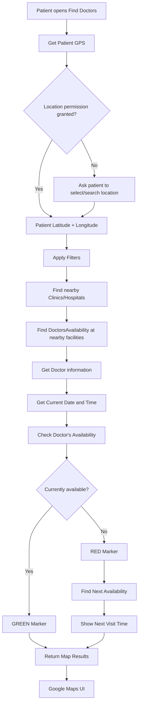

---

# 9. How Nearby Search Works

Suppose the patient is at:

```text
latitude  = 23.3441
longitude = 85.3240
```

The backend searches nearby:

```text
Clinics
+
Hospitals
```

using their latitude/longitude.

For example:

```text
Patient
23.3441, 85.3240

Nearby:

Apollo Hospital
23.3500, 85.3200
1.2 km

City Clinic
23.3600, 85.3150
2.4 km

Dental Care
23.3900, 85.3000
6.1 km
```

The backend then finds doctors available at those facilities.

---

# 10. Complete Search Architecture

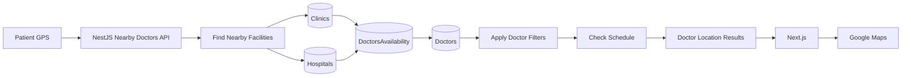

---

# 11. Filtering

The patient can filter by:

### Doctor name

```text
doctorName = Rahul
```

### Specialization

```text
specialization = Cardiology
```

### Clinic

```text
clinicName = City Clinic
```

### Hospital

```text
hospitalName = Apollo Hospital
```

Filters are applied after/alongside the nearby facility search.

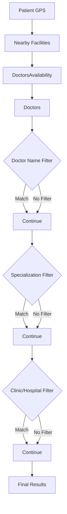

---

# 12. Green Marker — Doctor Currently Available

Example:

```text
Current time:
Wednesday 10:30 AM

DoctorsAvailability:

Doctor: Rahul
Hospital: Apollo
Wednesday
09:00 - 13:00
```

Because:

```text
09:00 <= 10:30 <= 13:00
```

the doctor is currently available.

Response:

```json
{
  "doctorId": "D1",
  "doctorName": "Dr. Rahul",
  "specialization": "Cardiology",
  "facilityType": "hospital",
  "facilityName": "Apollo Hospital",
  "latitude": 23.3500,
  "longitude": 85.3200,
  "status": "PRESENT",
  "nextVisit": null
}
```

Map:

```text
🟢 Dr. Rahul
Apollo Hospital
Available now
1.2 km
```

---

# 13. Red Marker — Doctor Visits Later

Suppose:

```text
Current time:
Thursday 10:30 AM
```

but the doctor has:

```text
Wednesday 09:00 - 13:00
Friday    16:00 - 20:00
```

The doctor is associated with the facility, but is not currently available.

Response:

```json
{
  "doctorId": "D1",
  "doctorName": "Dr. Rahul",
  "facilityName": "Apollo Hospital",
  "latitude": 23.3500,
  "longitude": 85.3200,
  "status": "NOT_PRESENT",
  "nextVisit": {
    "weekday": "Friday",
    "startTime": "16:00",
    "endTime": "20:00"
  }
}
```

Map:

```text
🔴 Dr. Rahul
Apollo Hospital

Next visit:
Friday
4:00 PM - 8:00 PM
```

---

# 14. Status Calculation

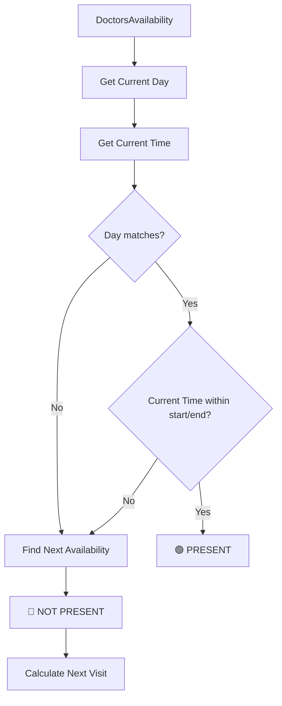

---

# 15. Recommended API

A possible endpoint:

```http
GET /doctors/nearby
```

Parameters:

```text
latitude
longitude
radius
doctorName
specialization
clinicId
hospitalId
```

Example:

```http
GET /doctors/nearby?latitude=23.3441&longitude=85.3240&radius=10&specialization=Cardiology
```

The backend should return **location-based results**, not just doctors.

One doctor can therefore appear multiple times if they have multiple nearby facilities.

Example:

```json
{
  "results": [
    {
      "doctorId": "D1",
      "doctorName": "Dr. Rahul",
      "specialization": "Cardiology",
      "facilityType": "hospital",
      "facilityId": "H1",
      "facilityName": "Apollo Hospital",
      "latitude": 23.3500,
      "longitude": 85.3200,
      "distanceKm": 1.2,
      "status": "PRESENT"
    },
    {
      "doctorId": "D1",
      "doctorName": "Dr. Rahul",
      "specialization": "Cardiology",
      "facilityType": "clinic",
      "facilityId": "C1",
      "facilityName": "City Clinic",
      "latitude": 23.3600,
      "longitude": 85.3150,
      "distanceKm": 2.4,
      "status": "NOT_PRESENT",
      "nextVisit": {
        "weekday": "Thursday",
        "startTime": "16:00",
        "endTime": "20:00"
      }
    }
  ]
}
```

This is important because your UI requirement is:

> Show **all locations where the doctor is present/visits**.

---

# 16. Google Maps UI

The frontend receives:

```text
doctor
facility
latitude
longitude
distance
status
nextVisit
```

and renders:

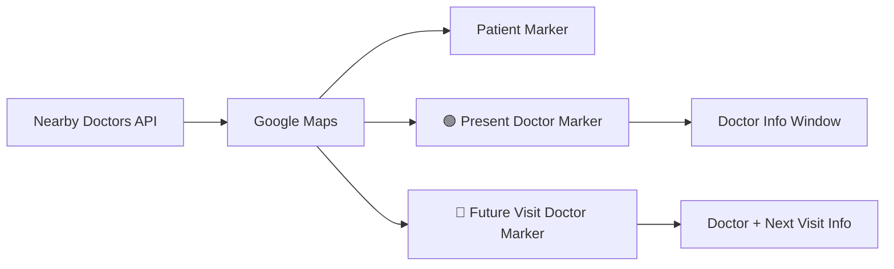

The Google Maps layer is responsible for displaying markers.

The HealthSync backend is responsible for deciding:

```text
Who?
Where?
How far?
Present?
Next visit?
```

---

# 17. Important Database Rule

Your `DoctorsAvailability` currently has:

```ts
hospital?: Hospital;
clinic?: Clinic;
```

Logically, each availability should belong to:

```text
Clinic XOR Hospital
```

meaning exactly one:

```text
Clinic OR Hospital
```

not:

```text
Clinic + Hospital
```

and not:

```text
nothing
```

Validate this in your service:

```ts
if (!clinicId && !hospitalId) {
  throw new BadRequestException(
    'Either clinic or hospital is required',
  );
}

if (clinicId && hospitalId) {
  throw new BadRequestException(
    'Availability cannot belong to both clinic and hospital',
  );
}
```

---

# 18. Final Architecture

Your current design can therefore be represented as:

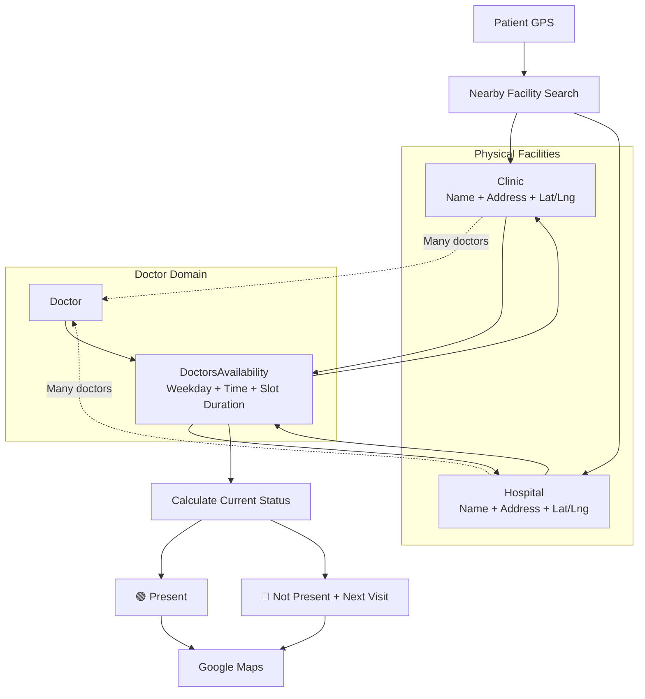

---

# 19. Final Data Model

The clean mental model for your current implementation is:

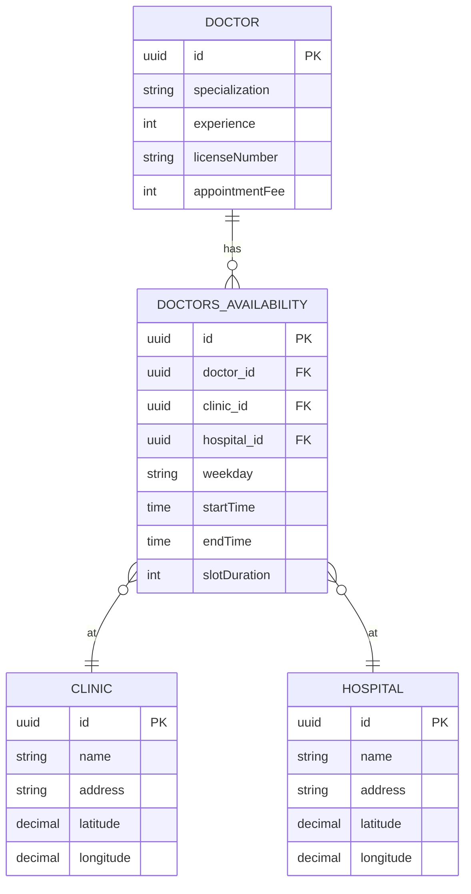

**This means you do not need `DoctorsLocation` with your current design.** `DoctorsAvailability` already provides the doctor → facility relationship plus the schedule, while `Clinic`/`Hospital` provide the physical coordinates.

One architectural improvement I'd consider later is replacing the two nullable foreign keys (`clinic_id` and `hospital_id`) with a common `Facility`/`HealthcareFacility` table. But for your current project, your existing design is perfectly workable and keeps the implementation straightforward.
